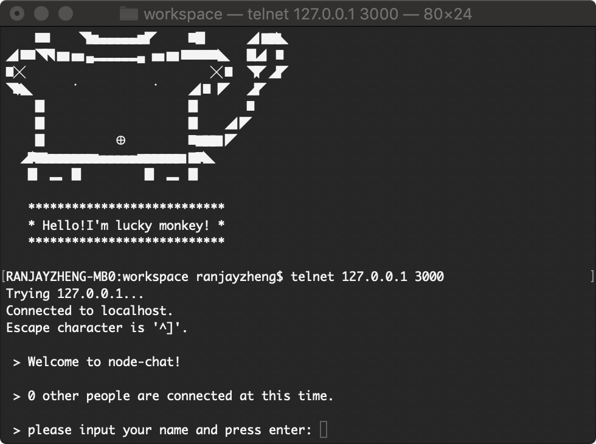
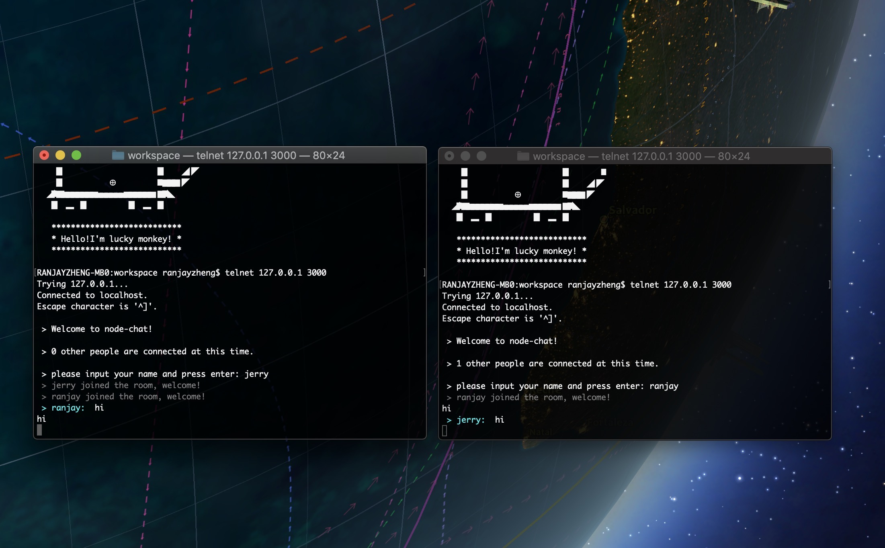

# telnet-chat

A chat demo based on node.js net module.

## usage

Download this project and run command: 

```shell
$ npm start
```

It will log `server is listening at port 3000`

Open your terminal and create a telnet link to 127.0.0.1:3000:

```shell
$ telnet 127.0.0.1 3000
```

You will see:



Enter a nickname at will and open another terminal with the same steps.

There will be a simple chat room:

